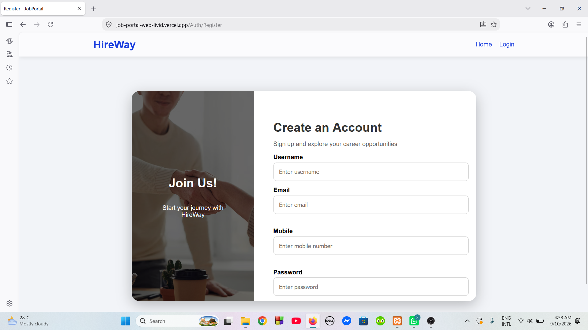
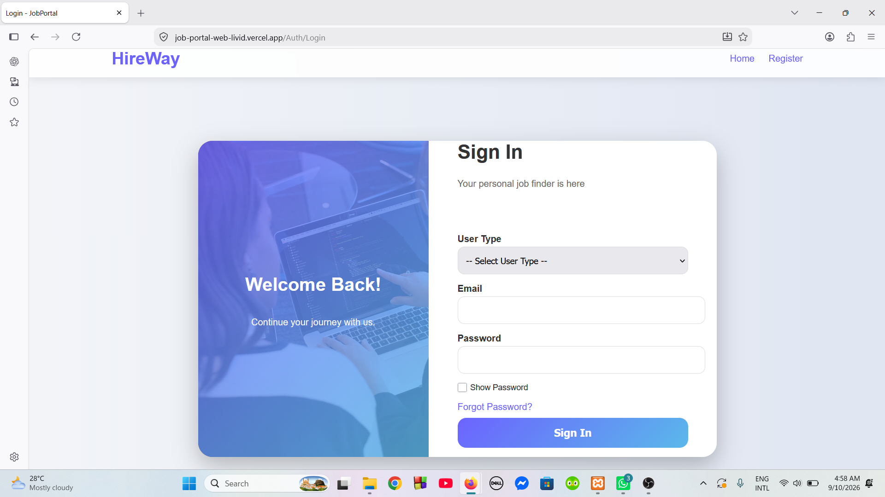
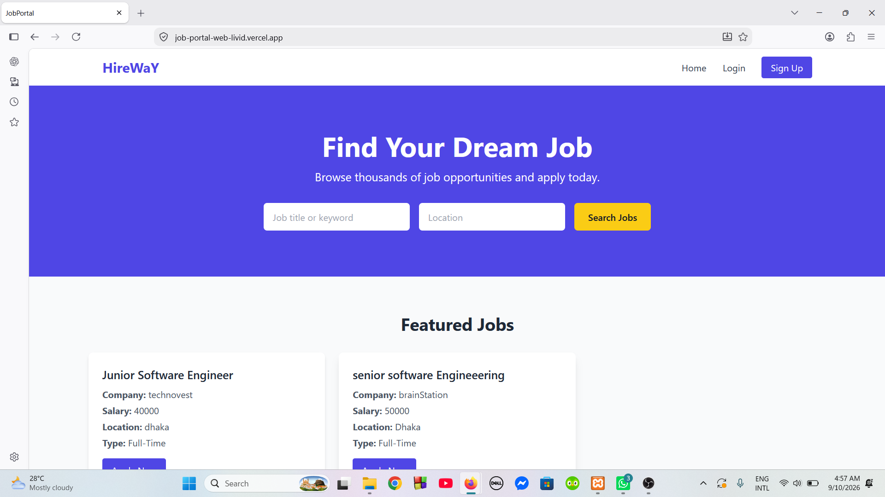
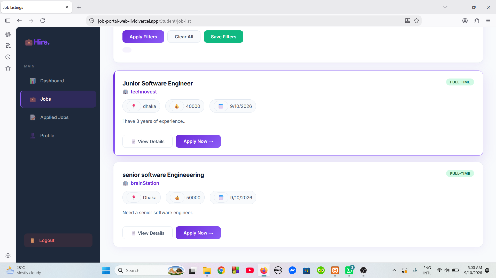
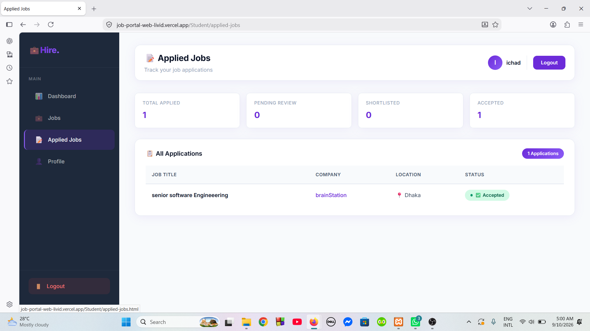
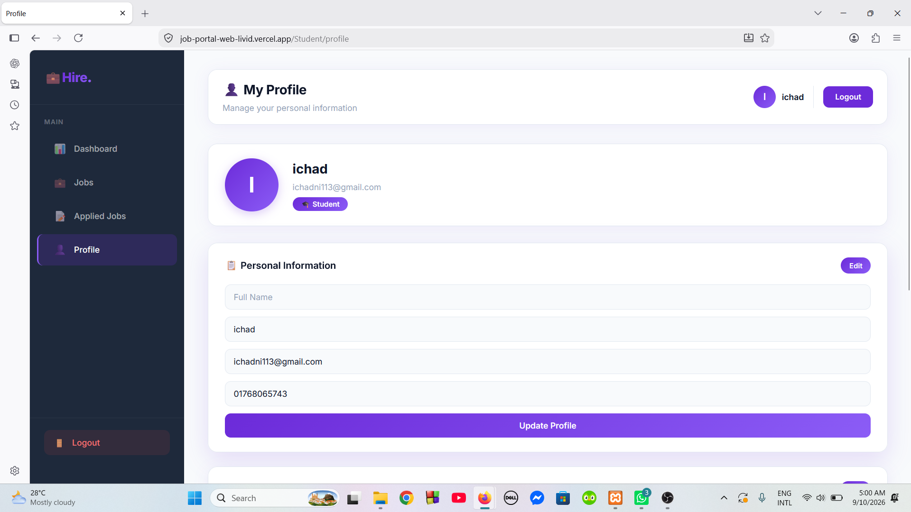
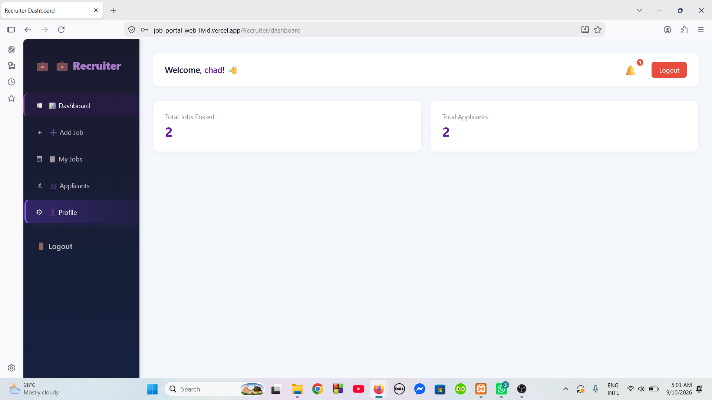
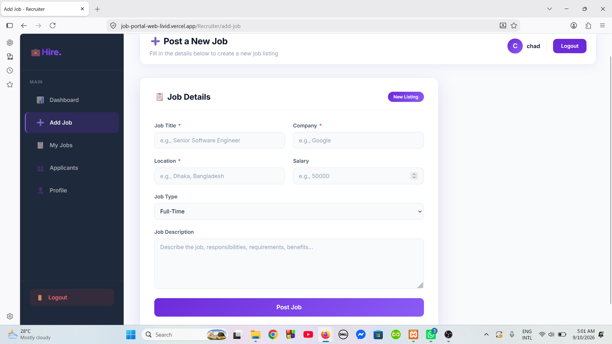
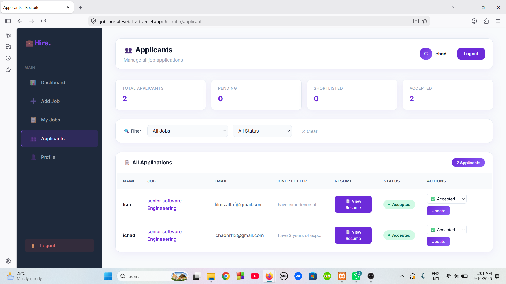
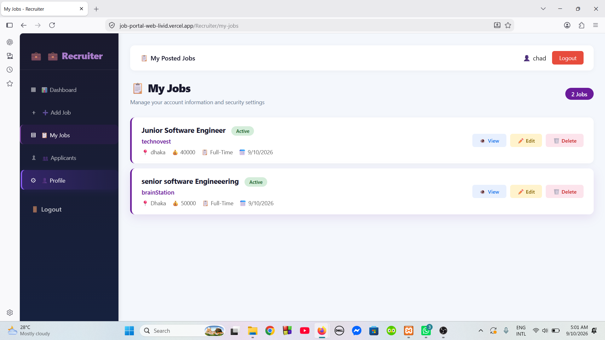

# 💼 HireWay — Job Portal Web Application

<p align="center">
  <strong>A modern full-stack job portal connecting job seekers with recruiters.</strong>
</p>

<p align="center">
  <a href="https://job-portal-web-livid.vercel.app/">Live Demo</a>
  •
  <a href="https://github.com/ichadni/JOB_Portal_Web">Source Code</a>
</p>

<p align="center">
  
  
  
  
  
  
</p>

<p align="center">
  
  
  
</p>

---

## 🌐 Live Application

### 🚀 [Visit HireWay — Live Demo](https://job-portal-web-livid.vercel.app/)

**GitHub:**
https://github.com/ichadni/JOB_Portal_Web

---

## 📖 About The Project

**HireWay** is a full-stack **Job Portal Web Application** developed to simplify the recruitment process by providing a centralized platform for **job seekers, recruiters, and administrators**.

The platform allows job seekers to discover and apply for suitable job opportunities, while recruiters can publish job vacancies, manage their postings, and review applicants.

An administrative interface provides functionality for managing users and maintaining the platform.

The project demonstrates practical implementation of:

* Frontend web development
* Backend API development
* Relational database management
* Authentication and authorization
* CRUD operations
* Client-server communication
* Deployment and production hosting

---

# ✨ Core Features

## 👨‍🎓 Job Seeker

* Create an account
* Secure login
* Browse available jobs
* Search and filter job opportunities
* View complete job information
* Apply for available positions
* View submitted applications
* Track application information
* Manage personal profile

---

## 🏢 Recruiter

* Recruiter registration and login
* Dedicated recruiter dashboard
* Create job vacancies
* Edit job postings
* Manage posted jobs
* View applicants
* Review applicant information
* Manage applications
* Update job-related information
* Manage recruiter profile

---

## 🛡️ Administration

* Admin authentication
* Admin dashboard
* View registered users
* Add users
* Edit user information
* Delete users
* Manage platform users

---

# 🧩 System Modules

```text
┌─────────────────────────────────────────────────────┐
│                    HIREWAY                          │
│                 JOB PORTAL SYSTEM                   │
└─────────────────────────┬───────────────────────────┘
                          │
        ┌─────────────────┼─────────────────┐
        │                 │                 │
        ▼                 ▼                 ▼
   JOB SEEKER         RECRUITER           ADMIN
        │                 │                 │
        ▼                 ▼                 ▼
   Browse Jobs        Post Jobs        Manage Users
   Search Jobs        Edit Jobs        View Users
   Job Details        Manage Jobs      Add Users
   Apply Jobs         View Applicants  Edit Users
   Applications       Manage Apps      Delete Users
   Profile            Profile
```

---

# 🏗️ Application Architecture

```text
                         ┌──────────────────┐
                         │      USERS       │
                         │                  │
                         │ Student          │
                         │ Recruiter        │
                         │ Admin            │
                         └────────┬─────────┘
                                  │
                                  ▼
                    ┌─────────────────────────┐
                    │       FRONTEND          │
                    │                         │
                    │ HTML5                   │
                    │ CSS3                    │
                    │ JavaScript              │
                    └────────────┬────────────┘
                                 │
                           HTTP / REST
                                 │
                                 ▼
                    ┌─────────────────────────┐
                    │        BACKEND          │
                    │                         │
                    │ Node.js                 │
                    │ Express.js              │
                    │ REST API                │
                    └────────────┬────────────┘
                                 │
                          SQL Queries
                                 │
                                 ▼
                    ┌─────────────────────────┐
                    │        DATABASE         │
                    │                         │
                    │         MySQL           │
                    │       Railway           │
                    └─────────────────────────┘
```

---

# 🔄 How The System Works

### Job Seeker Flow

```text
Register / Login
      ↓
Browse Jobs
      ↓
Search / Filter
      ↓
View Job Details
      ↓
Apply for Job
      ↓
Application Stored
      ↓
View Applications
```

### Recruiter Flow

```text
Register / Login
      ↓
Recruiter Dashboard
      ↓
Create Job
      ↓
Publish Job
      ↓
Receive Applications
      ↓
View Applicants
      ↓
Manage Applications
```

### Admin Flow

```text
Admin Login
     ↓
Admin Dashboard
     ↓
View Users
     ↓
Add / Edit Users
     ↓
Delete Users
     ↓
Manage Platform
```

---

# 🛠️ Technology Stack

| Layer                       | Technology              |
| --------------------------- | ----------------------- |
| **Frontend**                | HTML5, CSS3, JavaScript |
| **Backend**                 | Node.js, Express.js     |
| **Database**                | MySQL                   |
| **Frontend Hosting**        | Vercel                  |
| **Backend Hosting**         | Render                  |
| **Database Hosting**        | Railway                 |
| **Version Control**         | Git, GitHub             |
| **Development Environment** | Visual Studio Code      |

---

# 📸 Application Showcase

> The following screenshots showcase the major interfaces and workflows of the HireWay platform.

## 🔐 Authentication

### Create Account

<p align="center">
  
</p>

### Sign In

<p align="center">
  
</p>

---

## 🏠 Home & Job Discovery

### Home Page

<p align="center">
  
</p>

### Student Job Dashboard

<p align="center">
  
</p>

### Job Details

<p align="center">
  
</p>

---

## 📝 Job Application

### Application Form

<p align="center">
  
</p>

### Student Profile

<p align="center">
  
</p>

## 🏢 Recruiter Dashboard

### Recruiter Dashboard

<p align="center">
  
</p>

### Post New Job

<p align="center">
  
</p>

### Aplications

<p align="center">
  
</p>

### Recruiter Job Details

<p align="center">
  
</p>


## 🛡️ Admin Panel

### User Management

<p align="center">
  
</p>

### Admin Dashboard

<p align="center">
  
</p>

---

# 📂 Project Structure

```text
JOB_Portal_Web/
│
├── frontend/
│   │
│   ├── css/
│   ├── js/
│   ├── images/
│   └── *.html
│
├── backend/
│   │
│   ├── routes/
│   ├── controllers/
│   ├── models/
│   ├── config/
│   ├── middleware/
│   ├── server.js
│   └── package.json
│
├── screenshots/
│   ├── 01-create-account.png
│   ├── 02-sign-in.png
│   ├── 03-home-page.png
│   ├── 04-student-job-dashboard.png
│   ├── 05-job-details.png
│   ├── 06-job-application-form.png
│   ├── 07-application-submission.png
│   ├── 08-my-applications.png
│   ├── 09-recruiter-dashboard.png
│   ├── 10-edit-job.png
│   ├── 11-post-new-job.png
│   ├── 12-recruiter-job-details.png
│   ├── 13-applicants-management.png
│   ├── 14-admin-users-management.png
│   └── 15-admin-dashboard.png
│
├── .gitignore
├── README.md
└── package.json
```

> **Note:** Modify the structure above if the actual folders in your repository have different names.

---

# ⚙️ Local Installation

## Prerequisites

Before running the project, make sure the following are installed:

* [Node.js](https://nodejs.org/)
* MySQL
* Git
* Visual Studio Code

---

## 1️⃣ Clone the Repository

```bash
git clone https://github.com/ichadni/JOB_Portal_Web.git
```

```bash
cd JOB_Portal_Web
```

---

## 2️⃣ Install Dependencies

Navigate to the backend directory:

```bash
cd backend
```

Install the required dependencies:

```bash
npm install
```

---

## 3️⃣ Configure Environment Variables

Create a `.env` file inside the backend directory.

```env
PORT=5000

DB_HOST=your_database_host
DB_PORT=3306
DB_USER=your_database_user
DB_PASSWORD=your_database_password
DB_NAME=your_database_name
```

### ⚠️ Security

Never commit your `.env` file to GitHub.

Add the following to `.gitignore`:

```text
node_modules/
.env
```

---

## 4️⃣ Start the Backend

```bash
npm start
```

For development mode, if configured:

```bash
npm run dev
```

The backend will be available at:

```text
http://localhost:5000
```

---

## 5️⃣ Run the Frontend

Open the frontend using a local development server such as **VS Code Live Server**.

The frontend communicates with the Express.js backend through HTTP requests.

---

# 🗄️ Database

The application uses **MySQL** as its relational database.

The production database is hosted on **Railway**.

### Database Responsibilities

The database stores and manages information related to:

* Users
* Job seekers
* Recruiters
* Job postings
* Job applications
* Application information
* User roles

The Node.js/Express.js backend handles communication between the frontend and MySQL database.

---

# 🔌 Backend

The backend is developed using:

```text
Node.js
    +
Express.js
    +
MySQL
```

The backend provides the server-side logic required for:

* User authentication
* User management
* Job management
* Application processing
* Recruiter operations
* Database operations
* API communication

---

# 🌍 Deployment Architecture

```text
                    INTERNET
                       │
                       ▼
             ┌───────────────────┐
             │      Vercel       │
             │     Frontend      │
             └─────────┬─────────┘
                       │
                   API Requests
                       │
                       ▼
             ┌───────────────────┐
             │      Render       │
             │     Backend       │
             │ Node.js/Express   │
             └─────────┬─────────┘
                       │
                   SQL Queries
                       │
                       ▼
             ┌───────────────────┐
             │      Railway      │
             │      MySQL        │
             └───────────────────┘
```

### Deployment Services

| Component      | Platform |
| -------------- | -------- |
| Frontend       | Vercel   |
| Backend        | Render   |
| MySQL Database | Railway  |

---

# 📊 Main Functionalities

| Functionality     | Student | Recruiter | Admin |
| ----------------- | :-----: | :-------: | :---: |
| Register          |    ✅    |     ✅     |   —   |
| Login             |    ✅    |     ✅     |   ✅   |
| Browse Jobs       |    ✅    |     —     |   —   |
| Search Jobs       |    ✅    |     —     |   —   |
| View Job Details  |    ✅    |     ✅     |   —   |
| Apply for Jobs    |    ✅    |     —     |   —   |
| View Applications |    ✅    |     ✅     |   —   |
| Create Jobs       |    —    |     ✅     |   —   |
| Edit Jobs         |    —    |     ✅     |   —   |
| Manage Applicants |    —    |     ✅     |   —   |
| Manage Users      |    —    |     —     |   ✅   |
| User Profile      |    ✅    |     ✅     |   —   |

---

# 🎯 Project Goals

The primary goals of HireWay are to:

* Build a practical real-world web application
* Simplify the job search process
* Connect recruiters with potential candidates
* Provide efficient job management
* Provide a structured application process
* Implement a complete client-server architecture
* Integrate a relational database
* Deploy the application to production

---

# 📚 Learning Outcomes

This project provided hands-on experience with:

### Frontend Development

* Semantic HTML
* CSS layouts
* Responsive design
* JavaScript DOM manipulation
* Form handling
* Client-side validation

### Backend Development

* Node.js
* Express.js
* REST APIs
* Routing
* Middleware
* Server-side validation
* CRUD operations

### Database

* MySQL
* SQL queries
* Relational data
* Database connectivity
* Data management

### Deployment

* Vercel
* Render
* Railway
* Production environment configuration

### Development Workflow

* Git
* GitHub
* Version control
* Project organization
* Debugging

---

# 🚀 Future Enhancements

The project can be further improved with:

* 📄 Resume/CV upload
* 📧 Automated email notifications
* 🔔 Real-time application notifications
* 🔎 Advanced job filtering
* 📍 Location-based job search
* 🏷️ Job categories and skills
* ⭐ Save/bookmark jobs
* 🤖 AI-powered job recommendations
* 📊 Recruiter analytics
* 👤 Recruiter verification
* 🔐 Advanced security
* 📱 Progressive Web App support

---

# 🤝 Contributing

Contributions, suggestions, and improvements are welcome.

### Steps to contribute

```bash
# Fork the repository

# Clone your fork
git clone https://github.com/ichadni/JOB_Portal_Web.git

# Create a new branch
git checkout -b feature/your-feature

# Make your changes

# Commit your changes
git commit -m "Add new feature"

# Push your branch
git push origin feature/your-feature
```

Then open a Pull Request.

---

# 📬 Contact

### Israt Jahan Chadni

**GitHub:**
https://github.com/ichadni

**Project Repository:**
https://github.com/ichadni/JOB_Portal_Web

---

# ⭐ Show Your Support

If you found this project interesting, useful, or helpful, please consider giving the repository a ⭐ **Star**.

<p align="center">
  <strong>Built with ❤️ using HTML, CSS, JavaScript, Node.js, Express.js & MySQL</strong>
</p>

<p align="center">
  © 2026 HireWay — Job Portal Web Application
</p>
